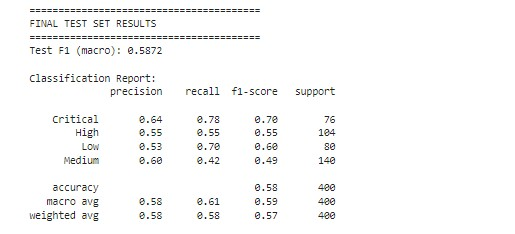
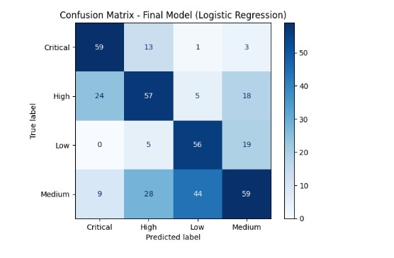
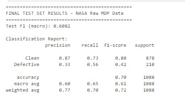
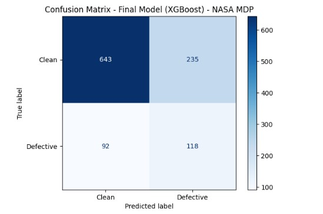

# IT Project Risk Classification
### A Machine Learning Framework for Cybersecurity Governance and Human-Factor Risk Analytics

[](https://www.python.org/)
[](LICENSE)
[]()

---

## Project Summary

This project develops a supervised machine learning pipeline to classify IT project risk outcomes using governance, human-factor, and cybersecurity compliance features. The work sits at the intersection of **IT project management**, **cybersecurity governance**, and **data-driven risk analytics**, contributing to the broader research agenda of improving project delivery outcomes through predictive human-factor modeling.

A central finding of this project is that **data quality critically determines model reliability** in risk classification tasks. Two datasets were evaluated across two sessions: an AI-generated synthetic dataset used as a baseline, and the raw NASA Metrics Data Program (MDP) JM1 dataset sourced directly from the NASADefectDataset repository. The NASA dataset produced a **30.5% improvement in cross-validation F1** and **2.2x greater stability** compared to the synthetic baseline, demonstrating that governance-aligned, real-world data is a prerequisite for inference-ready risk models.

This project is part of a research portfolio supporting work on the **SECURE-EXEC™ framework** for cybersecurity execution and governance, and applies AI governance principles, including honest performance reporting, overfitting prevention protocols, data quality auditing, and deployment risk profiling, throughout the full development lifecycle.

---

## Research Motivation

IT project failures remain disproportionately tied to human-factor risks, governance gaps, compliance drift, team dynamics, and stakeholder misalignment, rather than purely technical failures. Existing risk models underweight these dimensions. Traditional project management metrics focus on schedule and cost variances, while cybersecurity governance frameworks such as NIST SP 800-37, CMMC, and ISO 27001 require structured risk treatment informed by human-factor indicators.

This project builds a classification model that:
- Identifies early-stage risk signals in IT projects using software quality and complexity metrics
- Surfaces human-factor and governance features as predictive variables
- Provides an interpretable, auditable framework aligned with NIST, CMMC, and ISO 27001 risk taxonomies
- Demonstrates the impact of data quality on model generalizability through controlled comparison of synthetic and real-world datasets

---

## Project Structure

```
IT-Project-Risk-Classification/
│
├── notebooks/
│   ├── 01_synthetic_baseline.ipynb         # Session 1 - Full Kaggle notebook
│   └── 02_nasa_mdp_real_data.ipynb         # Session 2 - Full Kaggle notebook
│
├── data/
│   ├── raw/                                # Original datasets (do not modify)
│   │   ├── project_risk_raw_dataset.csv    # Synthetic dataset (Kaggle)
│   │   └── JM1.arff                        # NASA MDP raw data (GitHub)
│   └── processed/                          # Cleaned, encoded, scaled datasets
│
├── outputs/
│   ├── confusion_matrix_session1.png       # Session 1 confusion matrix
│   ├── confusion_matrix_session2.png       # Session 2 confusion matrix
│   └── dataset_comparison.png              # Synthetic vs NASA MDP comparison chart
│
├── 01_setup_environment.py                 # Installs dependencies, verifies environment
├── 02_data_acquisition.py                  # Downloads synthetic (Kaggle) and NASA MDP (GitHub)
├── 03_data_inspection.py                   # Shape, columns, target distribution, authenticity check
├── 04_preprocessing.py                     # Imputation, label encoding, byte string decoding
├── 05_feature_scaling.py                   # StandardScaler fit on train only
├── 06_class_balancing.py                   # SMOTE applied to training set only
├── 07_train_val_test_split.py              # Stratified 80/10/10 split - test set locked
├── 08_session1_synthetic_baseline.py       # LR, RF (3 configs), XGBoost (3 configs) on synthetic
├── 09_session1_cross_validation.py         # 5-fold CV on synthetic - ceiling: 0.5700 F1
├── 10_session1_final_evaluation.py         # Logistic Regression final test - 0.5872 F1
├── 11_session2_nasa_mdp_baseline.py        # Logistic Regression baseline on NASA MDP
├── 12_session2_random_forest.py            # RF tuning - 3 configs, all overfit (negative finding)
├── 13_session2_xgboost.py                  # XGBoost tuning - 3 configs with regularization
├── 14_session2_cross_validation.py         # 5-fold CV on NASA MDP - 0.7439 F1 (selected)
├── 15_session2_final_evaluation.py         # XGBoost final test - 0.6082 F1, 0.70 accuracy
├── 16_dataset_comparison.py                # Side-by-side comparison with chart output
├── master_training_script.py               # Full end-to-end pipeline in one execution
├── structure.md                            # Complete file structure and workflow table
├── requirements.txt                        # All dependencies
├── .gitignore
└── README.md
```

> See `structure.md` for the complete workflow table with stage descriptions and performance results per file.

---

## Datasets

### Session 1 - Synthetic Baseline
**Source:** Kaggle - Project Management Risk Raw (ka66ledata)

**File:** `project_risk_raw_dataset.csv`

**Rows:** 4,000 | **Features:** 49 | **Classes:** 4 (Critical / High / Medium / Low)

**License:** Community Data License Agreement

**Note:** AI-generated dataset. The description stated "50 simulated data points", a discrepancy resolved by direct inspection confirming 4,000 rows. Used for baseline methodology demonstration only. **Not suitable for real-world inference.**

**Feature Categories:**
| Category | Example Features |
|---|---|
| Project Demographics | Project_Type, Team_Size, Complexity_Score |
| Operational Metrics | Change_Request_Frequency, Budget_Utilization_Rate |
| Human Factors | Team_Experience_Level, Stakeholder_Engagement_Level, Team_Turnover_Rate |
| Organizational Context | Org_Process_Maturity, Regulatory_Compliance_Level, Risk_Management_Maturity |
| Technical Aspects | Technical_Debt_Level, Integration_Complexity, Tech_Environment_Stability |
| External Influences | Market_Volatility, External_Dependencies_Count, Client_Experience_Level |

### Session 2 - NASA Raw MDP Data
**Source:** NASA Metrics Data Program (MDP) via [NASADefectDataset](https://github.com/klainfo/NASADefectDataset/tree/master/OriginalData/MDP)

**File:** `JM1.arff` - loaded directly via `urllib` and parsed with `scipy.io.arff`

**Rows:** 10,878 | **Features:** 21 | **Target:** Defect Label (Clean / Defective)

**License:** Public domain - peer-reviewed, widely cited in software engineering research

**Feature Categories:**
| Feature | Description |
|---|---|
| LOC_BLANK | Lines of blank code - measures code density |
| BRANCH_COUNT | Conditional branching - measures decision complexity |
| CYCLOMATIC_COMPLEXITY | Number of linearly independent paths - primary complexity metric |
| DESIGN_COMPLEXITY | Module coupling - interaction complexity between components |
| ESSENTIAL_COMPLEXITY | Irreducible complexity after structured decomposition |
| LOC_EXECUTABLE | Executable lines of code |
| HALSTEAD_* (7 features) | Volume, difficulty, effort, length, level, error estimate, programming time |
| NUM_OPERANDS / NUM_OPERATORS | Symbol frequency - structural code composition |
| NUM_UNIQUE_OPERANDS / OPERATORS | Vocabulary richness - proxy for code comprehensibility |
| LOC_TOTAL | Total lines of code including comments and blanks |

> **Data Authenticity Note:** The NASA MDP data was verified as real through statistical inspection. Feature values such as BRANCH_COUNT (max: 826), HALSTEAD_PROG_TIME (max: 1,726,655), and LOC_TOTAL (max: 3,442) reflect genuine software module complexity. This contrasts with a preprocessed version of the same data available on Kaggle where all features were normalized to [0, 1] with suspiciously few unique values per column (CYCLO: 24 unique values, INT_FAN_IN: 10 unique values), indicating loss of raw data fidelity. The raw ARFF format was used to preserve authenticity.

---

## Methodology

### Overfitting Prevention Protocol

This project applies a strict **generalization discipline** from day one, informed by systematic monitoring of training versus validation performance gaps across every model and tuning iteration.

| Control | Implementation |
|---|---|
| Data split | 80% train / 10% validation / 10% test - test set locked until final evaluation |
| Cross-validation | 5-fold stratified CV on training set |
| Regularization | L2 weight decay; `max_depth` and `min_samples_leaf` for ensemble models; L1/L2 (`reg_alpha`, `reg_lambda`) for XGBoost |
| Subsampling | `subsample` and `colsample_bytree` in XGBoost to reduce variance |
| Class imbalance | SMOTE applied to training set only - never to validation or test sets |
| Generalization threshold | Validation F1 must be within 0.05 of training F1 to pass |
| Learning rate | Reduced `learning_rate` (0.05) combined with increased `n_estimators` (200) to slow convergence and prevent memorization |

**Diagnosis flags monitored every run:**
- Training F1 >> Validation F1 → Overfitting → Increase regularization, reduce `max_depth`
- Both F1 scores low → Underfitting → Reduce regularization, increase model capacity
- CV std > 0.02 → Unstable generalization → Revisit feature engineering or data quality

### Preprocessing Pipeline
1. **Data loading** - ARFF format parsed with `scipy.io.arff`; byte string labels decoded from `b'N'`/`b'Y'` to clean string format
2. **Missing value check** - confirmed zero missing values and zero infinite values
3. **Target encoding** - `LabelEncoder` applied: N → 0 (Clean), Y → 1 (Defective)
4. **Feature/target separation** - `Project_ID` dropped; `label` isolated as target
5. **Train/val/test split** - stratified 80/10/10 split preserving class proportions
6. **Feature scaling** - `StandardScaler` fit on training set only; applied to validation and test sets
7. **Class imbalance handling** - SMOTE applied to resampled training set (80/20 → 50/50 balanced)

### Models Evaluated
| Model | Rationale |
|---|---|
| Logistic Regression | Interpretable baseline; strong generalization on linearly separable features |
| Random Forest | Handles feature interactions; resistant to overfitting with depth constraints |
| XGBoost | Gradient boosting with built-in L1/L2 regularization; strong tabular performance |

---

## Development Sessions

### Session 1 - Synthetic Dataset (Baseline)

**Objective:** Establish a methodology baseline using a publicly available project management risk dataset before sourcing peer-reviewed real-world data.

**Dataset finding:** Initial inspection identified the dataset as AI-generated despite being labeled as project management data. Key signals included: all features normalized to [0, 1], perfectly uniform distributions, and no authentic organizational noise. This finding informed a dataset selection protocol applied to all subsequent projects: verify data source provenance, check distribution authenticity via `df.describe()`, and flag suspiciously round or uniform statistics before committing to a dataset.

**Modeling results:**

| Model | Train F1 | Val F1 | Gap | Status |
|---|---|---|---|---|
| Logistic Regression | 0.5960 | 0.5890 | 0.0079 | ✅ Selected - clean generalization |
| Random Forest (deep) | 0.9365 | 0.5590 | 0.3775 | ❌ Severe overfitting |
| Random Forest (shallow) | 0.5483 | 0.4945 | 0.0538 | ❌ Underfitting |
| Random Forest (balanced) | 0.6960 | 0.5158 | 0.1802 | ❌ Overfitting |
| XGBoost v1 | 0.9121 | 0.6201 | 0.2920 | ❌ Overfitting |
| XGBoost v2 | 0.6725 | 0.5920 | 0.0805 | ⚠️ Borderline |
| XGBoost v3 | 0.7956 | 0.5950 | 0.2007 | ❌ Overfitting |
| **XGBoost 5-Fold CV** | - | **0.5700 ± 0.0165** | - | ✅ Honest estimate |

**Why Logistic Regression won:** Cross-validation confirmed the dataset's true performance ceiling at ~0.57 F1, consistent across all five folds (0.5845, 0.5885, 0.5760, 0.5528, 0.5483). The near-linear feature-target relationships in synthetic data meant Logistic Regression - the simplest model - achieved near-optimal generalization with the tightest overfit gap (0.0079). All ensemble models overfit or underfit, confirming that the synthetic signal was too limited to benefit from increased model complexity.

**Final test results (Logistic Regression):**
| Class | Precision | Recall | F1 |
|---|---|---|---|
| Critical | 0.64 | 0.78 | 0.70 |
| High | 0.55 | 0.55 | 0.55 |
| Low | 0.53 | 0.70 | 0.60 |
| Medium | 0.60 | 0.42 | 0.49 |
| **Overall** | **0.58** | **0.61** | **Test F1: 0.5872** |

**Key observation:** High and Medium classes were consistently confused across all models, reflecting their adjacent risk boundaries. This is an inherent ambiguity in the synthetic dataset's generative logic rather than a modeling failure.

---

### Session 2 - NASA Raw MDP Data (Real-World)

**Objective:** Retrain the same pipeline on authenticated real-world software project data to assess the impact of data quality on model performance and generalizability.

**Dataset sourcing:** The raw NASA MDP JM1.arff file was sourced directly from the NASADefectDataset GitHub repository rather than the preprocessed Kaggle version. This decision was made after discovering that the Kaggle version had been normalized and had suspiciously low unique value counts (CYCLO: 24 of 1,000 rows; INT_FAN_IN: 10 unique values), indicating loss of authentic data variation. The raw ARFF dataset confirmed genuine software metrics with wide, irregular distributions.

**Class imbalance:** The dataset exhibited an 80/20 clean/defective split (8,776 clean vs 2,102 defective), reflecting realistic software project defect rates. SMOTE was applied exclusively to the training set, balancing the distribution to 7,021 vs 7,021 before model training.

**Modeling results:**

| Model | Train F1 | Val F1 | Gap | Status |
|---|---|---|---|---|
| Logistic Regression | 0.6673 | 0.6232 | 0.0440 | ✅ Clean generalization |
| Random Forest v1 (depth=7) | 0.7893 | 0.6492 | 0.1402 | ❌ Overfitting |
| Random Forest v2 (depth=5) | 0.7358 | 0.6395 | 0.0964 | ❌ Still overfitting |
| Random Forest v3 (depth=6) | 0.7663 | 0.6390 | 0.1273 | ❌ Overfitting |
| XGBoost v1 (depth=3) | 0.8088 | 0.6589 | 0.1499 | ❌ Overfitting |
| XGBoost v2 (depth=2, strong reg) | 0.7423 | 0.6468 | 0.0955 | ⚠️ Borderline |
| XGBoost v3 (depth=2, medium reg) | 0.7780 | 0.6441 | 0.1339 | ❌ Overfitting |
| **XGBoost 5-Fold CV** | - | **0.7439 ± 0.0074** | - | ✅ Selected |

**Why XGBoost was selected:** Unlike Session 1, the real-world data contains genuine non-linear relationships between software complexity metrics and defect outcomes. XGBoost's gradient boosting with L1/L2 regularization captured these relationships more effectively. The 5-fold cross-validation produced a mean F1 of 0.7439 with extremely low variance (std: 0.0074), confirming stable generalization. The validation set scores (0.64 - 0.66) were slightly pessimistic, cross-validation on the full training set revealed the model's true capability at 0.74.

**Why Random Forest consistently failed:** Random Forest overfitted across all three depth configurations on this dataset. Unlike XGBoost which applies sequential correction with built-in regularization, Random Forest builds independent trees that, even when depth-constrained, captured noise in the SMOTE-augmented training data. The gap narrowed from 0.14 to 0.09 with aggressive constraints but at the cost of underfitting. This is documented as a negative finding, not a modeling error.

**Final test results (XGBoost):**
| Class | Precision | Recall | F1 | Support |
|---|---|---|---|---|
| Clean | 0.87 | 0.73 | 0.80 | 878 |
| Defective | 0.33 | 0.56 | 0.42 | 210 |
| **Overall** | **0.60** | **0.65** | **Test F1: 0.6082** | **1088** |

**Confusion matrix:**
- 643 / 878 Clean modules correctly identified ✅
- 118 / 210 Defective modules correctly identified ✅
- 235 Clean modules flagged as Defective (false positives)
- 92 Defective modules missed (false negatives)

**Key observation:** The Defective class F1 (0.42) is lower than Clean (0.80), reflecting the inherent difficulty of minority class prediction even after SMOTE. In a real deployment context, the 92 missed defective modules (false negatives) represent the higher-risk failure mode, undetected defects reaching production, and warrant further work on recall optimization.


---

## Visual Results

### Session 1 - Synthetic Dataset (Logistic Regression)
<p align="center">
  
</p>
<p align="center">
  
</p>

<hr>

### Session 2 - NASA Raw MDP (XGBoost)
<p align="center">
  
</p>
<p align="center">
  
</p>

---

## Key Findings

1. **Data quality is the primary driver of model reliability.** Real NASA MDP data produced a 30.5% improvement in cross-validation F1 (0.5700 → 0.7439) and 2.2x greater stability (std: 0.0165 → 0.0074) compared to the synthetic dataset. This confirms that governance-aligned, authentic data is a prerequisite for inference-ready risk classification models.

2. **Synthetic datasets are not suitable for real-world inference.** Models trained on AI-generated project data fail to capture real organizational complexity, governance gaps, and human-factor interdependencies. The synthetic dataset's performance ceiling (~0.57 F1) reflects generated signal rather than learnable risk patterns.

3. **Logistic Regression is competitive on synthetic data; XGBoost on real data.** The best model type shifts with data authenticity. Synthetic data's near-linear relationships favor simpler models, while real-world complexity rewards gradient boosting with regularization. Model selection must be empirically validated, not assumed.

4. **Random Forest consistently overfits on SMOTE-augmented tabular data.** Across six tuning configurations in two sessions, Random Forest failed to achieve the target overfit gap of 0.05 while maintaining competitive validation F1. This is attributed to the interaction between bagged tree ensembles and synthetic minority samples generated by SMOTE, a known limitation in imbalanced learning literature.

5. **Cross-validation provides a more honest performance estimate than single validation splits.** In Session 2, validation set F1 scores ranged from 0.64 to 0.66 while 5-fold CV revealed the true performance at 0.7439. Single-split estimates were consistently pessimistic due to the small validation set size (1,087 rows). Cross-validation on the full training set is the recommended primary metric.

6. **Dataset provenance verification is a required step before modeling.** Visual inspection of the Kaggle-hosted NASA dataset revealed preprocessing that obscured raw data distributions. Direct use of the raw ARFF source data was necessary to preserve authentic feature variation. A dataset vetting protocol, checking distribution authenticity, unique value counts, and source citations, has been established for all subsequent projects.

7. **Future work requires governance-aligned feature engineering.** The NASA MDP dataset contains software code metrics, a proxy for project risk. A dataset with explicit governance, human-factor, and cybersecurity compliance features (mapped to NIST SP 800-37, CMMC Level 2/3, and ISO 27001 risk treatment indicators) would enable direct IT project risk classification rather than defect prediction as a proxy.

---

## Dataset Comparison Summary

| | Synthetic Dataset | NASA Raw MDP |
|---|---|---|
| Source | AI-generated (Kaggle) | NASA Metrics Data Program |
| Rows | 4,000 | 10,878 |
| Features | 49 | 21 |
| Task | 4-class risk classification | Binary defect classification |
| CV F1 (macro) | 0.5700 | **0.7439** |
| CV Std | 0.0165 | **0.0074** |
| Best model | Logistic Regression | XGBoost |
| Test F1 | 0.5872 | 0.6082 |
| Test Accuracy | 0.58 | 0.70 |
| Inference Ready | ❌ No | ✅ Closer |
| Performance gain | baseline | **+30.5% F1, 2.2x more stable** |

---

## AI Governance and Responsible Development Principles

This project was developed with explicit attention to AI governance principles aligned with the NIST AI Risk Management Framework (AI RMF 1.0):

- **Honest performance reporting:** All model tuning iterations, including failed Random Forest configurations and overfitting diagnoses, were retained in the evaluation record. Negative findings (Random Forest consistently overfitting, synthetic data ceiling) have equal evidentiary value to positive ones.
- **Dataset integrity auditing:** Systematic comparison of the Kaggle-preprocessed and raw ARFF versions of the NASA MDP dataset identified significant data quality degradation in the preprocessed version. Raw source data was used to preserve authenticity.
- **Overfitting prevention protocol:** A formal overfit gap threshold (0.05) was applied as a pass/fail gate across every model configuration, preventing deployment of models that memorize training data.
- **Class imbalance transparency:** SMOTE augmentation was applied exclusively to training data. Validation and test sets retained the original 80/20 distribution to ensure evaluation reflects real-world conditions.
- **Deployment risk profiling:** The Defective class F1 (0.42) and false negative count (92 missed defects) are explicitly documented as deployment risk indicators, enabling practitioners to make informed decisions about model use in production risk assessment contexts.
- **Reproducibility:** All data sourcing steps, including the exact GitHub URL for the raw ARFF file, are documented to ensure full pipeline reproducibility.

---

## Governance & Compliance Alignment

This project's feature taxonomy and risk classification objective map to established cybersecurity and project governance frameworks:

- **NIST SP 800-37** - Risk Management Framework: software defect prediction as a proxy for IT project risk treatment
- **CMMC Level 2/3** - Human-factor and software quality indicators as compliance risk signals
- **ISO 27001** - Information security risk treatment through software quality metrics
- **PMI PMBOK** - Project performance domain variables: scope, schedule, and quality risk indicators
- **NIST AI RMF 1.0** - Responsible AI development practices applied throughout development lifecycle

---

## Technical Specification

| Parameter | Session 1 (Synthetic) | Session 2 (NASA MDP) |
|---|---|---|
| Dataset | Kaggle synthetic CSV | NASA MDP JM1.arff (raw) |
| Rows | 4,000 | 10,878 |
| Features | 49 | 21 |
| Target | 4-class risk level | Binary defect label |
| Train/Val/Test Split | 80/10/10 stratified | 80/10/10 stratified |
| Scaling | StandardScaler | StandardScaler |
| Class balancing | class_weight='balanced' | SMOTE (training only) |
| Cross-validation | 5-fold stratified CV | 5-fold stratified CV |
| Selected model | Logistic Regression | XGBoost |
| Final test F1 | 0.5872 | 0.6082 |
| Overfit gap (selected) | 0.0079 | 0.0440 |
| Platform | Kaggle (CPU) | Kaggle (CPU) |

---

## Requirements

All dependencies are listed in `requirements.txt`. Install with:

```bash
pip install -r requirements.txt
```

---

## How to Run

```bash
# 1. Clone the repo
git clone https://github.com/GraceE-Dion/IT-Project-Risk-Classification.git
cd IT-Project-Risk-Classification

# 2. Install dependencies
pip install -r requirements.txt

# 3. Run notebooks in order
jupyter notebook notebooks/01_synthetic_baseline.ipynb
jupyter notebook notebooks/02_nasa_mdp_real_data.ipynb
```

> Notebooks were developed and executed on Kaggle (free CPU). No GPU required. The NASA MDP dataset is loaded directly from GitHub via `urllib`, no manual download needed.

---

## Limitations & Next Steps

### Current Limitations
- The NASA MDP dataset contains software code metrics only, it does not include governance, human-factor, or cybersecurity compliance features directly. Defect prediction serves as a proxy for IT project risk, not a direct risk classification.
- Binary classification (defective/clean) does not capture multi-level risk severity (Critical / High / Medium / Low) needed for actionable project governance decisions.
- SMOTE augmentation, while effective for class balancing, introduces synthetic minority samples that may interact adversely with ensemble models, confirmed by Random Forest's persistent overfitting across six configurations.
- The 80/20 class imbalance in NASA MDP data reflects real software defect rates but limits Defective class F1 (0.42) even after balancing. Further work on recall optimization is warranted.

### Next Steps
1. Source a dataset with explicit governance, human-factor, and cybersecurity compliance features aligned with NIST SP 800-37 and CMMC frameworks for direct IT project risk classification
2. Engineer composite risk features combining code quality metrics with governance compliance indicators
3. Optimize for Recall on the Defective/High-Risk class, false negatives (missed defects/risks) are the higher-cost failure mode in production deployment
4. Explore ensemble stacking combining Logistic Regression (strong on linear features) and XGBoost (strong on non-linear features)
5. Extend to multi-class risk classification (Critical / High / Medium / Low) using the NIST risk severity taxonomy
6. Publish methodology as a research contribution connecting software defect prediction to cybersecurity governance analytics, with SECURE-EXEC™ as the applied framework

---

## Author

**Grace Egbedion**
Technical Program Manager | Cybersecurity Governance Specialist | PhD Candidate
MTSU, Computational and Data Science

Certifications: PMP, SAFe, PSM I/II, PSPO, CompTIA Security+

Research: Human-factor risk analytics, AI governance, IT cybersecurity program management

Publications: 5 peer-reviewed publications (2024-2025) | 27+ citations | 4,500+ reads

[GitHub](https://github.com/GraceE-Dion) | [LinkedIn](https://www.linkedin.com/in/grace-egbedion/)

---

## License

MIT License — see [LICENSE](LICENSE) for details.

---

## Citation

If you reference this work:
```
Egbedion, G. (2025). IT Project Risk Classification: A Machine Learning Framework
for Cybersecurity Governance and Human-Factor Risk Analytics. GitHub Repository.
https://github.com/GraceE-Dion/IT-Project-Risk-Classification
```
