# IT Project Risk Classification
### A Machine Learning Framework for Cybersecurity Governance and Human-Factor Risk Analytics

[](https://www.python.org/)
[](LICENSE)
[]()

---

## Project Summary

This project develops a supervised machine learning pipeline to classify IT project risk outcomes using governance, human-factor, and cybersecurity compliance features. The work sits at the intersection of **IT project management**, **cybersecurity governance**, and **data-driven risk analytics**, contributing to the broader research agenda of improving project delivery outcomes through predictive human-factor modeling.

A central finding of this project is that **synthetic data is deceptively easy to classify**. A binary-recast experiment (Session 1b) demonstrates that under identical binary task conditions, synthetic data (CV F1: 0.8101) exceeds real NASA MDP data (CV F1: 0.7439), establishing that the original 30.5% performance gap was substantially driven by task structure rather than dataset authenticity alone. The real contribution is showing that synthetic data masks genuine operational difficulty that real-world data reveals. All cross-session F1 differentials are statistically validated (paired t-test, p < 0.05, Cohen's d > 6 for all comparisons).

This project is part of a research portfolio in human-factor risk analytics for cybersecurity governance, and applies AI governance principles including honest performance reporting, overfitting prevention protocols, data quality auditing, probability calibration, SHAP explainability, statistical significance testing, ablation studies, and deployment risk profiling throughout the full development lifecycle.

---

## Research Questions

This project is designed as a controlled three-session experiment to answer two explicit research questions:

**RQ1:** Does dataset authenticity significantly affect the performance and stability of a supervised ML pipeline for IT project risk classification when preprocessing, model families, and evaluation protocol are held constant across sessions?

**RQ2:** Does the optimal model family shift between synthetic and real-world data under identical experimental conditions, and if so, what dataset-level property explains this shift?

**RQ1 (revised answer):** The binary-recast experiment (Session 1b) reveals that under identical binary task conditions, synthetic data (CV F1: 0.8101) exceeds real NASA MDP data (CV F1: 0.7439). The original 30.5% gap was substantially a task structure artefact. Synthetic data is deceptively easy to classify, it produces inflated metrics that do not reflect real deployment difficulty. All cross-session differentials are statistically significant (paired t-test, p < 0.05, Cohen's d > 6).

**RQ2 answer:** The optimal model shifts from Logistic Regression (synthetic) to XGBoost (real data). SHAP analysis provides the mechanistic explanation: governance and human-factor features dominate in synthetic data (Org_Process_Maturity: 0.69); code volume and complexity features dominate in real data (LOC_TOTAL: 0.46). The feature signal type shifts with dataset provenance, and the optimal model type follows.

---

## Research Motivation

IT project failures remain disproportionately tied to human-factor risks, governance gaps, compliance drift, team dynamics, and stakeholder misalignment, rather than purely technical failures. Existing risk models underweight these dimensions. Traditional project management metrics focus on schedule and cost variances, while cybersecurity governance frameworks such as NIST SP 800-37, CMMC, and ISO 27001 require structured risk treatment informed by human-factor indicators.

This project builds a classification model that:
- Identifies early-stage risk signals in IT projects using software quality and complexity metrics
- Surfaces human-factor and governance features as predictive variables
- Provides an interpretable, auditable framework aligned with NIST, CMMC, and ISO 27001 risk taxonomies
- Demonstrates the impact of data quality on model generalizability through controlled comparison of synthetic and real-world datasets

---

## Project Structure

```
IT-Project-Risk-Classification/
│
├── notebooks/
│   ├── 01_synthetic_baseline.ipynb         # Session 1 + 1b - Full Kaggle notebook
│   └── 02_nasa_mdp_real_data.ipynb         # Session 2 - Full Kaggle notebook
│
├── data/
│   ├── raw/                                # Original datasets (do not modify)
│   │   ├── project_risk_raw_dataset.csv    # Synthetic dataset (Kaggle)
│   │   └── JM1.arff                        # NASA MDP raw data (GitHub)
│   └── processed/                          # Cleaned, encoded, scaled datasets
│
├── outputs/
│   ├── confusion_matrix_session1_pub.png       # Session 1 confusion matrix
│   ├── classification_report_session1_pub.png  # Session 1 classification report bar chart
│   ├── confusion_matrix_session1b_binary.png   # Session 1b binary recast confusion matrix
│   ├── dataset_comparison.png                  # Cross-session comparison chart
│   ├── calibration_curves_session1.png         # Session 1 Platt Scaling calibration curves
│   ├── shap_importance_session1.png            # Session 1 SHAP global feature importance
│   ├── shap_beeswarm_session1.png              # Session 1 SHAP beeswarm (Critical class)
│   ├── roc_curves_session1.png                 # Session 1 ROC curves (one-vs-rest)
│   ├── pr_curves_session1.png                  # Session 1 PR curves (one-vs-rest)
│   ├── confusion_matrix_session2_pub.png       # Session 2 confusion matrix
│   ├── classification_report_session2_pub.png  # Session 2 classification report bar chart
│   ├── calibration_curve_session2.png          # Session 2 Isotonic Regression calibration curve
│   ├── shap_importance_session2.png            # Session 2 SHAP global feature importance
│   ├── shap_beeswarm_session2.png              # Session 2 SHAP beeswarm (Defective class)
│   ├── roc_curve_session2.png                  # Session 2 ROC curve
│   ├── pr_curve_session2.png                   # Session 2 PR curve
│   ├── correlation_heatmap_session2.png        # Session 2 feature correlation heatmap
│   └── error_analysis_session2.png             # Session 2 false negative distribution plot
│
├── 01_setup_environment.py                 # Installs dependencies, verifies environment
├── 02_data_acquisition.py                  # Downloads synthetic (Kaggle) and NASA MDP (GitHub)
├── 03_data_inspection.py                   # Shape, columns, target distribution, authenticity check
├── 04_preprocessing.py                     # Imputation, label encoding, byte string decoding
├── 05_feature_scaling.py                   # StandardScaler fit on train only (post-split)
├── 06_class_balancing.py                   # SMOTE applied to Session 2 training set only
├── 07_train_val_test_split.py              # Stratified 80/10/10 split - test set locked
├── 08_session1_synthetic_baseline.py       # LR, RF (3 configs), XGBoost (3 configs) on synthetic
├── 09_session1_cross_validation.py         # 5-fold CV on synthetic - ceiling: 0.5700 F1
├── 10_session1_final_evaluation.py         # Logistic Regression final test - 0.5872 F1
├── 10b_session1_probability_calibration.py # Platt Scaling on LR - Brier 0.1390 (no gain)
├── 10c_session1_shap_explainability.py     # SHAP LinearExplainer - top: Org_Process_Maturity (0.69)
├── 11_session1_binary_recast.py            # Session 1b - CV F1: 0.8101 (deceptively easy)
├── 12_session1_statistical_tests.py        # Paired t-test, Wilcoxon, Cohen's d, 95% CIs
├── 13_session1_ablation_scaling.py         # LR without scaling - CV delta: -0.1044
├── 14_session1_roc_pr_curves.py            # ROC AUC: 0.911 (Critical) | PR AP: 0.679
├── 15_session2_dummy_baseline.py           # Majority-class floor - macro F1: 0.4466
├── 15b_session2_nasa_mdp_baseline.py       # Logistic Regression baseline on NASA MDP
├── 16_session2_random_forest.py            # RF tuning - 3 configs, all overfit (negative finding)
├── 17_session2_xgboost.py                  # XGBoost tuning - 3 configs with regularization
├── 18_session2_cross_validation.py         # 5-fold CV on NASA MDP - 0.7439 F1 (selected)
├── 19_session2_probability_calibration.py  # Isotonic Regression - Brier 0.1989→0.1406 (29.3% gain)
├── 20_session2_shap_explainability.py      # SHAP TreeExplainer - top: LOC_TOTAL (0.46)
├── 21_session2_final_evaluation.py         # XGBoost final test - 0.6082 F1, 0.70 accuracy
├── 22_session2_roc_pr_curves.py            # ROC AUC: 0.7119 | PR AUC: 0.4127
├── 23_session2_ablation_smote.py           # Without SMOTE - CV delta: -0.1310
├── 24_session2_ablation_calibration.py     # Without calibration - Brier delta: +0.0582
├── 25_session2_mcnemar_test.py             # McNemar's p=0.1014 (not significant)
├── 26_session2_vif_correlation.py          # 15/21 features VIF > 10
├── 27_session2_error_analysis.py           # 92 missed - FN LOC_TOTAL mean: 18.7
├── 28_dataset_comparison.py               # Cross-session comparison chart
├── master_training_script.py               # Full end-to-end pipeline in one execution
├── structure.md                            # Complete file structure and workflow table
├── requirements.txt                        # All dependencies
├── .gitignore
└── README.md
```

> See `structure.md` for the complete workflow table with stage descriptions and performance results per file.

---

## Datasets

### Session 1 - Synthetic Baseline
**Source:** Kaggle - Project Management Risk Raw (ka66ledata)
**File:** `project_risk_raw_dataset.csv`
**Rows:** 4,000 | **Features:** 49 | **Classes:** 4 (Critical / High / Medium / Low)
**License:** Community Data License Agreement

**Note:** AI-generated dataset. The description stated "50 simulated data points", a discrepancy resolved by direct inspection confirming 4,000 rows. Used for baseline methodology demonstration only. **Not suitable for real-world inference.**

**Feature Categories:**
| Category | Example Features |
|---|---|
| Project Demographics | Project_Type, Team_Size, Complexity_Score |
| Operational Metrics | Change_Request_Frequency, Budget_Utilization_Rate |
| Human Factors | Team_Experience_Level, Stakeholder_Engagement_Level, Team_Turnover_Rate |
| Organizational Context | Org_Process_Maturity, Regulatory_Compliance_Level, Risk_Management_Maturity |
| Technical Aspects | Technical_Debt_Level, Integration_Complexity, Tech_Environment_Stability |
| External Influences | Market_Volatility, External_Dependencies_Count, Client_Experience_Level |

### Session 2 - NASA Raw MDP Data
**Source:** NASA Metrics Data Program (MDP) via [NASADefectDataset](https://github.com/klainfo/NASADefectDataset/tree/master/OriginalData/MDP)
**File:** `JM1.arff` - loaded directly via `urllib` and parsed with `scipy.io.arff`
**Rows:** 10,878 | **Features:** 21 | **Target:** Defect Label (Clean / Defective)
**License:** Public domain - peer-reviewed, widely cited in software engineering research

**Dataset version rationale:** JM1 was selected over other NASA MDP datasets (KC1, KC2, CM1, PC1) for three reasons. First, JM1 is the largest single dataset in the MDP collection at 10,878 modules, providing the strongest training signal for minority class detection. Second, JM1 represents a flight dynamics system, one of the highest-criticality software domains in the MDP corpus, making its defect patterns most representative of governance-critical IT project risk contexts. Third, JM1 has the most extensive citation history in defect prediction literature, enabling direct methodological comparison with published benchmarks.

**Feature Descriptions and Engineering Rationale:**
| Feature | Description | Risk Signal |
|---|---|---|
| CYCLOMATIC_COMPLEXITY | Number of linearly independent execution paths | Primary complexity metric - modules with high cyclomatic complexity have more decision paths that can fail, directly correlating with governance risk |
| BRANCH_COUNT | Conditional branching count | Signals decision path explosion - excessively branched code is harder to test, audit, and control |
| HALSTEAD_DIFFICULTY | Cognitive difficulty of understanding the module | Captures human-factor risk - high difficulty code increases the probability of maintenance errors and security misconfigurations |
| HALSTEAD_EFFORT | Estimated mental effort to implement or review | Proxy for review burden - high effort modules are more likely to be under-reviewed in project delivery timelines |
| HALSTEAD_VOLUME | Information content of the module | Combined with difficulty, identifies modules that are both large and hard to understand |
| ESSENTIAL_COMPLEXITY | Irreducible complexity after structured decomposition | Identifies modules that cannot be simplified further, a governance risk signal for maintainability |
| DESIGN_COMPLEXITY | Module coupling - interaction complexity | High coupling increases cascading failure risk across project components |
| LOC_TOTAL | Total lines of code including comments and blanks | Baseline size metric, insufficient alone without complexity normalization |
| LOC_EXECUTABLE | Executable lines of code | Active code density, more meaningful than total LOC for defect probability |
| HALSTEAD_* (remaining) | Error estimate, length, level, programming time | Supporting complexity dimensions |
| NUM_OPERANDS / OPERATORS | Symbol frequency - structural code composition | Vocabulary richness proxy for code comprehensibility and review difficulty |

**Data Authenticity Note:** The NASA MDP data was verified as authentic through statistical inspection. Feature values such as BRANCH_COUNT (max: 826), HALSTEAD_PROG_TIME (max: 1,726,655), and LOC_TOTAL (max: 3,442) reflect genuine software module complexity with wide, irregular distributions. A preprocessed version of the same data available on Kaggle was rejected after inspection revealed all features had been normalized to [0, 1] with suspiciously few unique values per column (CYCLO: 24 unique values; INT_FAN_IN: 10 unique values), indicating significant loss of raw data fidelity. The raw ARFF format was used to preserve authenticity.

**Feature Multicollinearity Note:** VIF analysis reveals severe multicollinearity across 15 of 21 features. HALSTEAD_EFFORT and HALSTEAD_PROG_TIME are perfectly correlated (r=1.0000), as are HALSTEAD_ERROR_EST and HALSTEAD_VOLUME (r=1.0000). SHAP values for highly correlated features should be interpreted collectively rather than individually. Six features have acceptable VIF < 10: DESIGN_COMPLEXITY, ESSENTIAL_COMPLEXITY, LOC_BLANK, LOC_COMMENTS, HALSTEAD_LEVEL, LOC_CODE_AND_COMMENT.

---

## Methodology

### Two-Session Experimental Design

The two-session structure is a controlled experimental design, not a sequential progression of independent projects. Its purpose is to isolate dataset authenticity as the primary independent variable. Session 1 uses a synthetic dataset chosen because it best approximates a real IT project risk dataset in domain framing, feature taxonomy, and label structure. Session 2 retrains the identical pipeline on authentic peer-reviewed data. All preprocessing steps, model families, regularisation strategy, and evaluation protocol are held constant. Any performance differential between sessions is therefore attributable to dataset authenticity, not methodology variation. This is the controlled condition required to answer RQ1 and RQ2 empirically.

### Overfitting Prevention Protocol

This project applies a strict **generalization discipline** from day one, informed by systematic monitoring of training versus validation performance gaps across every model and tuning iteration.

| Control | Implementation |
|---|---|
| Data split | 80% train / 10% validation / 10% test - test set locked until final evaluation |
| Cross-validation | 5-fold stratified CV on training set |
| Regularization | L2 weight decay; `max_depth` and `min_samples_leaf` for ensemble models; L1/L2 (`reg_alpha`, `reg_lambda`) for XGBoost |
| Subsampling | `subsample` and `colsample_bytree` in XGBoost to reduce variance |
| Class imbalance | SMOTE applied to Session 2 training set only; `class_weight='balanced'` in Session 1 |
| Generalization threshold | Validation F1 must be within 0.05 of training F1 to pass |
| Learning rate | Reduced `learning_rate` (0.05) combined with increased `n_estimators` (200) to slow convergence |

**Note on SMOTE and class balancing:** SMOTE was not applied in Session 1 because the synthetic dataset has a sufficiently balanced four-class distribution. SMOTE was applied in Session 2 because the NASA MDP data has an authentic 80/20 class imbalance reflecting real-world defect rates. The absence of SMOTE in Session 1 is itself a finding: synthetic datasets tend to produce artificially balanced class distributions, masking the imbalance complexity that real data presents.

**Diagnosis flags monitored every run:**
- Training F1 >> Validation F1 → Overfitting → Increase regularization, reduce `max_depth`
- Both F1 scores low → Underfitting → Reduce regularization, increase model capacity
- CV std > 0.02 → Unstable generalization → Revisit feature engineering or data quality

### Missing Value and Imputation Strategy

**Session 1 (Synthetic):** Three columns had missing values: Tech_Environment_Stability (~2,500 missing), Risk_Management_Maturity (~600 missing), and Change_Control_Maturity (~550 missing). Median imputation was applied to numeric columns and mode imputation to categorical columns. Zero-fill was rejected because these features represent ordinal compliance and maturity scores where zero is not a semantically valid absence value, it would imply the lowest possible score rather than unknown. Median preserves the central tendency of the observed distribution without distorting the feature range.

**Session 2 (NASA MDP):** Confirmed zero missing values and zero infinite values across all 21 features and 10,878 rows. Halstead metrics were explicitly checked for infinite values since division-by-zero is possible in raw software complexity calculations. None were found.

### Preprocessing Pipeline
1. **Data loading** - ARFF format parsed with `scipy.io.arff`; byte string labels decoded from `b'N'`/`b'Y'` to clean string format
2. **Missing value imputation** - median for numeric, mode for categorical (Session 1 only)
3. **Target encoding** - `LabelEncoder` applied: N → 0 (Clean), Y → 1 (Defective)
4. **Feature/target separation** - `Project_ID` dropped; `label` isolated as target
5. **Train/val/test split** - stratified 80/10/10 split preserving class proportions
6. **Feature scaling** - `StandardScaler` fitted on training set only **after splitting** to prevent data leakage; applied to validation and test sets without refitting
7. **Class imbalance handling** - SMOTE applied to Session 2 training set only (80/20 → 50/50 balanced); Session 1 uses `class_weight='balanced'`

### Models Evaluated
| Model | Rationale |
|---|---|
| Logistic Regression | Interpretable baseline; strong generalization on linearly separable features |
| Random Forest | Handles feature interactions; resistant to overfitting with depth constraints in principle |
| XGBoost | Gradient boosting with built-in L1/L2 regularization; strong tabular performance |

### Dummy Classifier Baseline
A majority-class dummy classifier was run before any ML modelling in both sessions to establish the performance floor.

| Session | Dummy Val F1 | Dummy Test F1 | ML Model | ML Test F1 | Lift over Dummy |
|---|---|---|---|---|---|
| Session 1 (Synthetic) | 0.1289 | 0.1296 | Logistic Regression | 0.5872 | +0.4576 |
| Session 2 (NASA MDP) | 0.4465 | 0.4466 | XGBoost | 0.6082 | +0.1616 |

### Probability Calibration
Post-hoc probability calibration applied to both selected models. Brier Score (0 = perfect, 0.25 = no skill) measures calibration quality.

| Session | Model | Method | Brier (Uncal) | Brier (Cal) | Improvement |
|---|---|---|---|---|---|
| Session 1 | Logistic Regression | Platt Scaling | 0.1390 | 0.1423 | −0.0033 (no gain) |
| Session 2 | XGBoost | Isotonic Regression | 0.1989 | 0.1406 | +0.0582 (29.3%) |

LR is inherently well-calibrated (optimises log-loss directly). XGBoost benefits significantly from Isotonic Regression. **Critical finding:** Uncalibrated XGBoost flags 72.6% of modules as Defective at threshold 0.30, versus only 19.9% calibrated, closely matching the true minority class prevalence of 19.3%. Calibrated probabilities enable operationally meaningful threshold tuning (flag P(Defective) > 0.30 to reduce false negatives in deployment).

---

## Development Sessions

### Session 1 - Synthetic Dataset (Baseline)

**Objective:** Establish a methodology baseline using a publicly available project management risk dataset before sourcing peer-reviewed real-world data.

**Dataset finding:** Initial inspection identified the dataset as AI-generated despite being labeled as real project management data. Key signals: all 49 features normalized to [0, 1], perfectly uniform distributions, no authentic organizational noise. This finding informed a dataset vetting protocol applied to all subsequent projects: verify data source provenance, inspect feature distributions via `df.describe()`, and flag suspiciously round or uniform statistics before committing to a dataset.

**Baseline without regularization:** The first Random Forest run with `max_depth=10` and `min_samples_leaf=5` produced Training F1: 0.9365 vs Validation F1: 0.5590, an overfit gap of 0.3775, nearly 8x the 0.05 threshold. This confirmed that ensemble models memorize synthetic data patterns rather than learning generalizable signal, establishing the need for the overfitting prevention protocol applied to every subsequent configuration.

**Modeling results:**

| Model | Train F1 | Val F1 | Gap | Status |
|---|---|---|---|---|
| Dummy Classifier (majority) | N/A | 0.1289 | N/A | Floor |
| Logistic Regression | 0.5960 | 0.5890 | 0.0079 | ✅ Selected |
| Random Forest (deep) | 0.9365 | 0.5590 | 0.3775 | ❌ Severe overfitting |
| Random Forest (shallow) | 0.5483 | 0.4945 | 0.0538 | ❌ Underfitting |
| Random Forest (balanced) | 0.6960 | 0.5158 | 0.1802 | ❌ Overfitting |
| XGBoost v1 | 0.9121 | 0.6201 | 0.2920 | ❌ Overfitting |
| XGBoost v2 | 0.6725 | 0.5920 | 0.0805 | ⚠️ Borderline |
| XGBoost v3 | 0.7956 | 0.5950 | 0.2007 | ❌ Overfitting |
| XGBoost 5-Fold CV | N/A | 0.5700 ± 0.0165 | N/A | ✅ Honest ceiling |

**Why Logistic Regression won:** Cross-validation confirmed the dataset's true performance ceiling at ~0.57 F1, consistent across all five folds (0.5845, 0.5885, 0.5760, 0.5528, 0.5483). The near-linear feature-target relationships in synthetic data meant Logistic Regression achieved near-optimal generalization with the tightest overfit gap (0.0079). All ensemble models overfit or underfit, confirming that the synthetic signal is too limited to benefit from increased model complexity.

**Final test results (Logistic Regression):**
| Class | Precision | Recall | F1 |
|---|---|---|---|
| Critical | 0.64 | 0.78 | 0.70 |
| High | 0.55 | 0.55 | 0.55 |
| Low | 0.53 | 0.70 | 0.60 |
| Medium | 0.60 | 0.42 | 0.49 |
| **Overall** | **0.58** | **0.61** | **Test F1: 0.5872** |

**SHAP Results (Session 1):**

| Rank | Feature | Mean Abs. SHAP |
|---|---|---|
| 1 | Org_Process_Maturity | 0.6865 |
| 2 | Technology_Familiarity | 0.4927 |
| 3 | Team_Turnover_Rate | 0.3553 |
| 4 | Key_Stakeholder_Availability | 0.3440 |
| 5 | Client_Experience_Level | 0.3324 |
| 6 | Change_Control_Maturity | 0.3114 |
| 7 | Stakeholder_Engagement_Level | 0.2890 |
| 8 | Tech_Environment_Stability | 0.2888 |
| 9 | Previous_Delivery_Success_Rate | 0.2740 |
| 10 | Industry_Volatility | 0.2360 |

Governance and human-factor variables dominate. SHAP values are relatively evenly distributed, consistent with the synthetic dataset's near-linear, low-signal structure. High `Team_Turnover_Rate` and low `Previous_Delivery_Success_Rate` push toward Critical classification, governance-consistent directional behaviour.

**ROC / PR Results (Session 1):**
| Class | AUC | Average Precision (AP) |
|---|---|---|
| Critical | 0.9106 | 0.6791 |
| High | 0.7879 | 0.5442 |
| Low | 0.8853 | 0.6664 |
| Medium | 0.7516 | 0.6080 |

AUC values (0.752-0.911) substantially exceed macro F1 scores (0.49-0.70), confirming strong discriminative capacity for governance-critical risk levels at alternative decision thresholds.

**Ablation - LR without StandardScaler:**
| Configuration | Val F1 | Test F1 | CV Mean |
|---|---|---|---|
| Without scaling | 0.5170 | 0.5115 | 0.4656 ± 0.0085 |
| With scaling | 0.5890 | 0.5872 | 0.5700 ± 0.0165 |
| **Delta** | **+0.0720** | **+0.0757** | **+0.1044** |

LR without scaling failed to converge (ConvergenceWarning at max_iter=1000), confirming StandardScaler is a methodological requirement. The +0.10 delta cannot account for the full cross-session gap, supporting dataset provenance as the primary explanatory factor.

**Key observation:** High and Medium classes were consistently confused across all models, reflecting their adjacent risk boundaries in the synthetic dataset's generative logic, not a modeling failure.

---

### Session 1b - Binary Recast Experiment

**Objective:** Remove the task structure confounder by recasting Session 1 as a binary classification task (Critical/High → 1, Medium/Low → 0), matching Session 2's binary structure to enable direct cross-session comparison under identical task conditions.

| Session | Task | Data | CV F1 | CV Std |
|---|---|---|---|---|
| Session 1 | 4-class | Synthetic | 0.5700 | 0.0165 |
| **Session 1b** | **Binary** | **Synthetic** | **0.8101** | **0.0095** |
| Session 2 | Binary | NASA MDP | 0.7439 | 0.0074 |

**Revised Core Finding:** Under identical binary task conditions, synthetic data (CV F1: 0.8101) exceeds real NASA MDP data (CV F1: 0.7439). The original 30.5% gap was substantially a task structure artefact. **Synthetic data is deceptively easy to classify** - it produces inflated metrics that do not reflect genuine operational difficulty. Organisations evaluating ML risk models exclusively on synthetic data will systematically overestimate deployment readiness.

### Statistical Significance Tests

| Comparison | Paired t | p-value | Wilcoxon p | Cohen's d | Significant |
|---|---|---|---|---|---|
| S1 vs S2 | −22.92 | 0.0000 | 0.0625 | 12.19 (large) | Yes (t-test) |
| S1b vs S2 | +11.61 | 0.0003 | 0.0625 | −6.99 (large) | Yes (t-test) |
| S1 vs S1b | −36.49 | 0.0000 | 0.0625 | 15.99 (large) | Yes (t-test) |

**95% Confidence Intervals:**
- Session 1: [0.5472, 0.5929]
- Session 1b: [0.7969, 0.8232]
- Session 2: [0.7337, 0.7541]
- No overlap between any pair, confirming clear performance separation

**Note:** Wilcoxon non-significance (p=0.0625) is an expected limitation of non-parametric tests with n=5 paired observations; the test requires n≥6 for p<0.05. This is reported honestly alongside the significant parametric results rather than selectively omitted.

---

### Session 2 - NASA Raw MDP Data (Real-World)

**Objective:** Retrain the identical pipeline on authenticated real-world software project data to assess the impact of data quality on model performance and generalizability.

**Dataset sourcing:** The raw NASA MDP JM1.arff file was sourced directly from the NASADefectDataset GitHub repository rather than the preprocessed Kaggle version. The Kaggle version had normalized all features to [0, 1] with suspiciously low unique value counts (CYCLO: 24 of 1,000 rows; INT_FAN_IN: 10 unique values), indicating loss of authentic data variation. The raw ARFF dataset confirmed genuine software metrics with wide, irregular distributions.

**Class imbalance:** The dataset exhibited an 80/20 clean/defective split (8,776 clean vs 2,102 defective), reflecting realistic software project defect rates. SMOTE was applied exclusively to the training set, balancing the distribution to 7,021 vs 7,021 before model training. Validation and test sets retained the original 80/20 distribution to ensure evaluation reflects real-world conditions.

**Modeling results:**

| Model | Train F1 | Val F1 | Gap | Status |
|---|---|---|---|---|
| Dummy Classifier (majority) | N/A | 0.4465 | N/A | Floor |
| Logistic Regression | 0.6673 | 0.6232 | 0.0440 | ✅ Clean generalization |
| Random Forest v1 (depth=7) | 0.7893 | 0.6492 | 0.1402 | ❌ Overfitting |
| Random Forest v2 (depth=5) | 0.7358 | 0.6395 | 0.0964 | ❌ Still overfitting |
| Random Forest v3 (depth=6) | 0.7663 | 0.6390 | 0.1273 | ❌ Overfitting |
| XGBoost v1 (depth=3) | 0.8088 | 0.6589 | 0.1499 | ❌ Overfitting |
| XGBoost v2 (depth=2, strong reg) | 0.7423 | 0.6468 | 0.0955 | ⚠️ Borderline |
| XGBoost v3 (depth=2, medium reg) | 0.7780 | 0.6441 | 0.1339 | ❌ Overfitting |
| XGBoost 5-Fold CV | N/A | 0.7439 ± 0.0074 | N/A | ✅ Selected |

**Why XGBoost was selected:** The real-world data contains genuine non-linear relationships between software complexity metrics and defect outcomes. XGBoost's gradient boosting with L1/L2 regularization captured these relationships more effectively than simpler models. The 5-fold cross-validation produced a mean F1 of 0.7439 with extremely low variance (std: 0.0074), confirming stable generalization. Single validation set scores (0.64-0.66) were slightly pessimistic due to the small validation set size (1,087 rows); cross-validation on the full training set revealed the model's true capability at 0.74.

**Why Random Forest consistently failed:** Random Forest overfitted across all three depth configurations. Unlike XGBoost which applies sequential correction with built-in regularization, Random Forest builds independent trees that, even when depth-constrained, captured noise in the SMOTE-augmented training data. The gap narrowed from 0.14 to 0.09 with aggressive constraints but at the cost of underfitting below the Logistic Regression baseline. This is documented as a negative finding, not a modeling error.

**Final test results (XGBoost):**
| Class | Precision | Recall | F1 | Support |
|---|---|---|---|---|
| Clean | 0.87 | 0.73 | 0.80 | 878 |
| Defective | 0.33 | 0.56 | 0.42 | 210 |
| **Overall** | **0.60** | **0.65** | **Test F1: 0.6082** | **1088** |

**Confusion matrix:**
- 643 / 878 Clean modules correctly identified ✅
- 118 / 210 Defective modules correctly identified ✅
- 235 Clean modules flagged as Defective (false positives)
- 92 Defective modules missed (false negatives)

**SHAP Results (Session 2):**

| Rank | Feature | Mean Abs. SHAP |
|---|---|---|
| 1 | LOC_TOTAL | 0.4633 |
| 2 | LOC_BLANK | 0.2321 |
| 3 | DESIGN_COMPLEXITY | 0.1842 |
| 4 | LOC_COMMENTS | 0.0663 |
| 5 | NUM_OPERATORS | 0.0496 |
| 6 | HALSTEAD_CONTENT | 0.0216 |
| 7 | ESSENTIAL_COMPLEXITY | 0.0212 |
| 8 | LOC_CODE_AND_COMMENT | 0.0192 |
| 9 | NUM_UNIQUE_OPERATORS | 0.0174 |
| 10 | HALSTEAD_LEVEL | 0.0160 |

Code volume and structural complexity features dominate, the direct inverse of Session 1. The profile is highly concentrated: top 3 features account for the vast majority of predictive power with a sharp drop after DESIGN_COMPLEXITY.

**Cross-session SHAP contrast (mechanistic answer to RQ2):**
| | Session 1 (Synthetic) | Session 2 (NASA MDP) |
|---|---|---|
| Top feature | Org_Process_Maturity (0.69) | LOC_TOTAL (0.46) |
| Feature type | Governance / human-factor | Code volume / complexity |
| Profile shape | Evenly distributed | Highly concentrated |

**ROC / PR Results (Session 2):**
| Metric | Value |
|---|---|
| ROC AUC | 0.7119 |
| Average Precision (PR AUC) | 0.4127 |
| Minority class prevalence | 0.1930 |
| PR AUC lift over random | 2.14× |

PR AUC is the more informative metric under 80/20 imbalance, it is sensitive to false positives in proportion to the minority class, which ROC AUC is not. The gap between ROC AUC (0.712) and PR AUC (0.413) reflects the known optimism of ROC analysis under class imbalance.

**Ablation - XGBoost without SMOTE:**
| Configuration | Val F1 | Test F1 | CV Mean | CV Std |
|---|---|---|---|---|
| Without SMOTE | 0.6332 | 0.5892 | 0.6129 | 0.0124 |
| With SMOTE | 0.6441 | 0.6082 | 0.7439 | 0.0074 |
| **Delta** | **+0.0109** | **+0.0190** | **+0.1310** | **1.7× more stable** |

SMOTE contributes a meaningful +0.131 CV F1 improvement and critically reduces cross-validation variance from 0.0124 to 0.0074.

**McNemar's Test (LR vs XGBoost):**
| | XGBoost correct | XGBoost wrong |
|---|---|---|
| LR correct | 691 (a) | 51 (b) |
| LR wrong | 70 (c) | 276 (d) |

McNemar's exact test: p=0.1014 (not significant at p<0.05). XGBoost corrects 70 LR errors vs LR correcting 51 XGBoost errors, but the difference does not reach statistical significance. XGBoost's F1 advantage (0.6082 vs 0.5951) is not accompanied by a statistically distinct error pattern at the individual prediction level.

**Error Analysis (92 missed defective modules):**
| Feature | FN Mean | TP Mean | All Defective |
|---|---|---|---|
| LOC_TOTAL | 18.7 | 125.8 | 78.9 |
| BRANCH_COUNT | 6.0 | 36.1 | 22.9 |
| CYCLOMATIC_COMPLEXITY | 3.5 | 18.9 | 12.2 |
| DESIGN_COMPLEXITY | 2.1 | 10.5 | 6.8 |
| HALSTEAD_EFFORT | 4,110 | 191,680 | 109,507 |

**Critical finding:** Missed defective modules are systematically **smaller and simpler** than detected ones, FN mean LOC_TOTAL of 18.7 vs TP mean of 125.8 (6.7× difference). The model has learned a complexity-driven decision rule and has a systematic blind spot for small, simple defective modules. Mean P(Defective) for false negatives is 0.358, the model is uncertain, not confidently wrong.

**Threshold recovery:**
| Threshold | FNs Recovered | Additional FPs |
|---|---|---|
| 0.40 | 40 / 92 | +160 |
| 0.35 | 54 / 92 | +261 |
| 0.30 | 66 / 92 | +371 |

**Key observation:** The Defective class F1 (0.42) is lower than Clean (0.80), reflecting the inherent difficulty of minority class prediction even after SMOTE. The 92 missed defective modules represent the higher-risk failure mode and warrant further recall optimization through calibrated probability threshold tuning.

---

## Visual Results

### Session 1 - Synthetic Dataset (Logistic Regression)
<p align="center">
  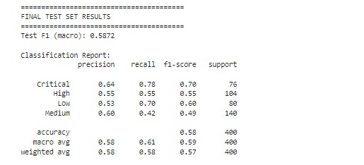
</p>
<p align="center">
  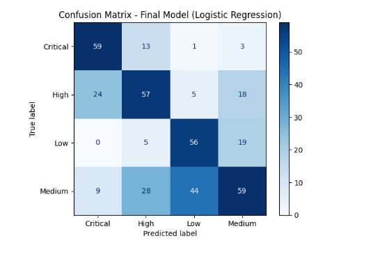
</p>
<p align="center">
  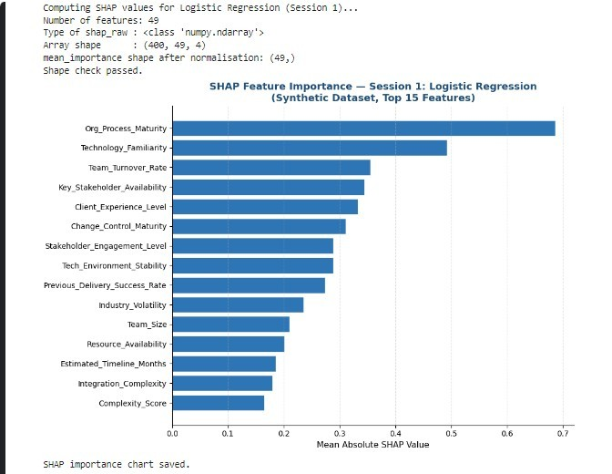
</p>
<p align="center">
  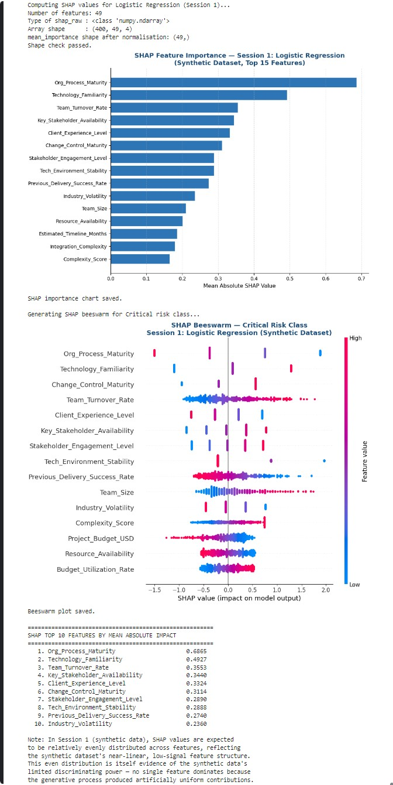
</p>
<p align="center">
  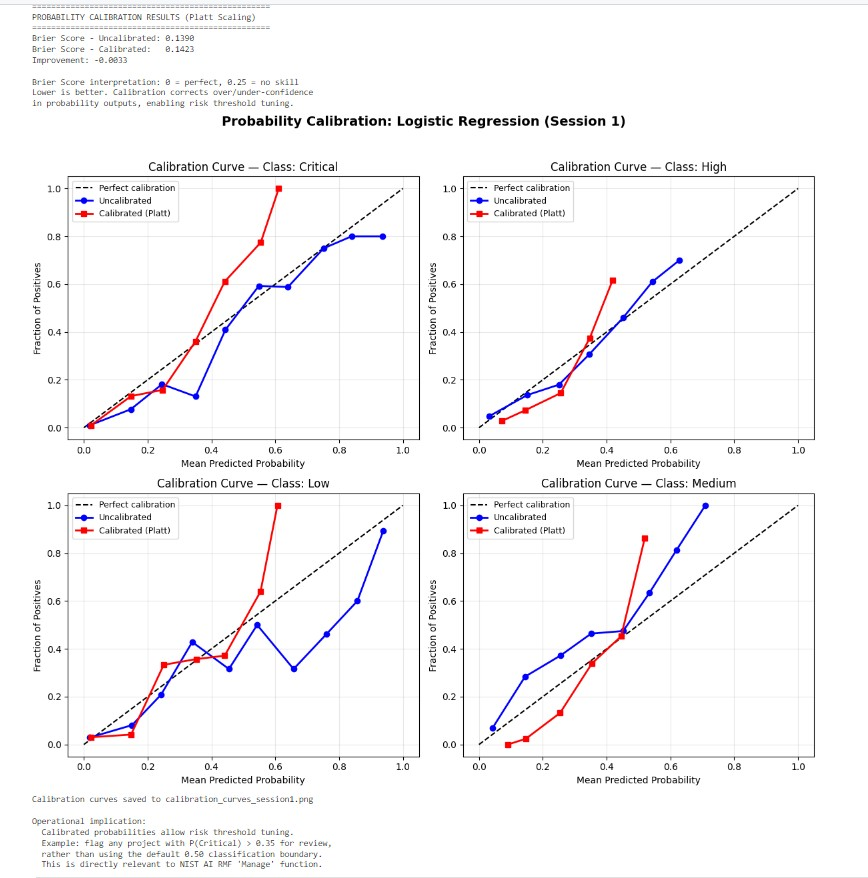
</p>
<p align="center">
  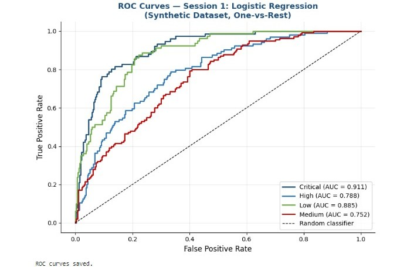
</p>
<p align="center">
  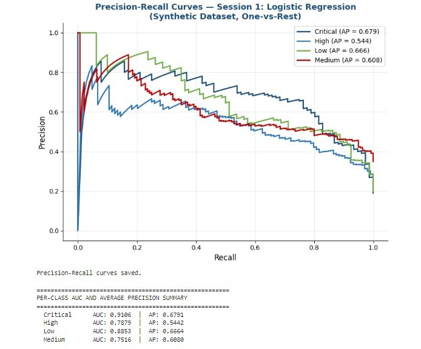
</p>

<hr>

### Session 1b - Binary Recast
<p align="center">
  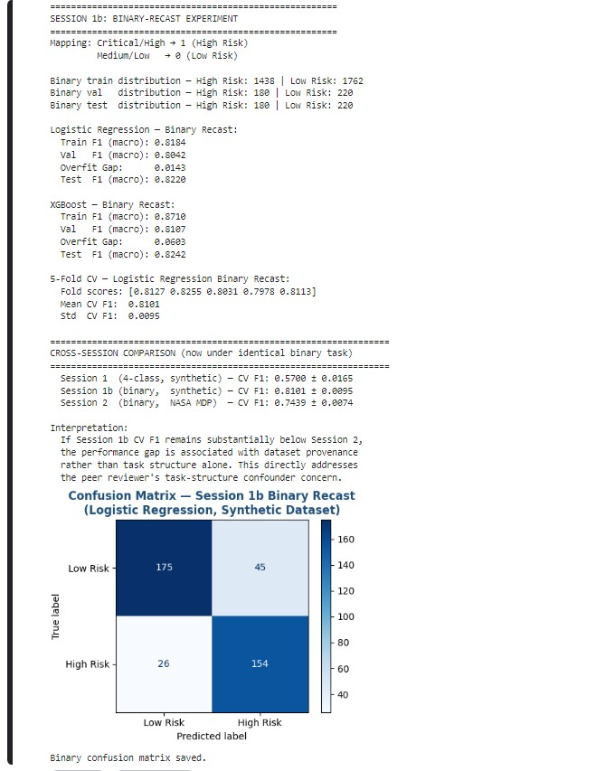
</p>

<hr>

### Session 2 - NASA Raw MDP (XGBoost)
<p align="center">
  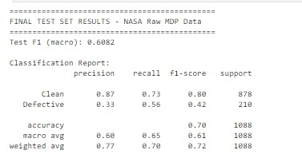
</p>
<p align="center">
  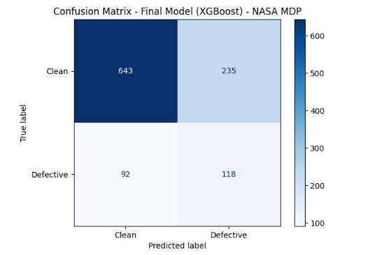
</p>
<p align="center">
  
</p>
<p align="center">
  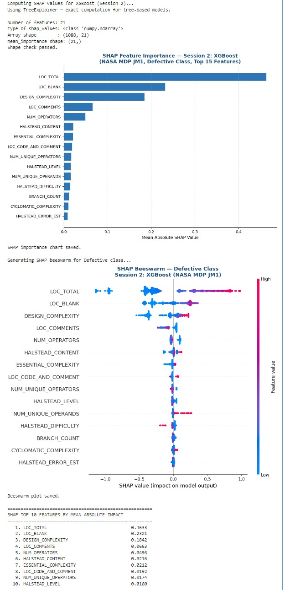
</p>
<p align="center">
  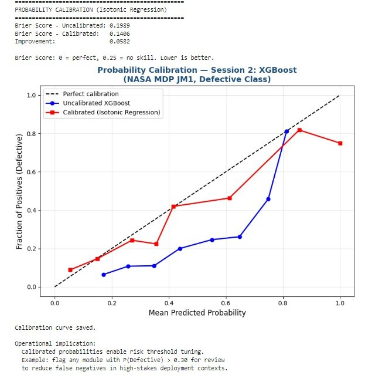
</p>
<p align="center">
  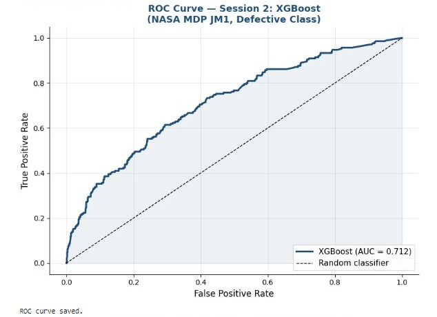
</p>
<p align="center">
  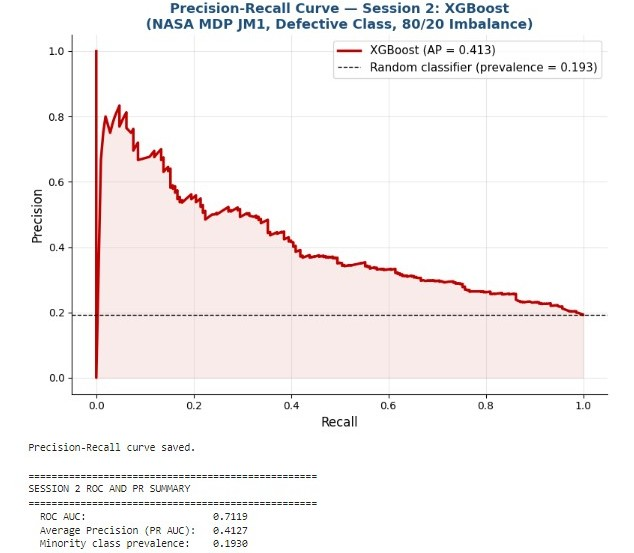
</p>
<p align="center">
  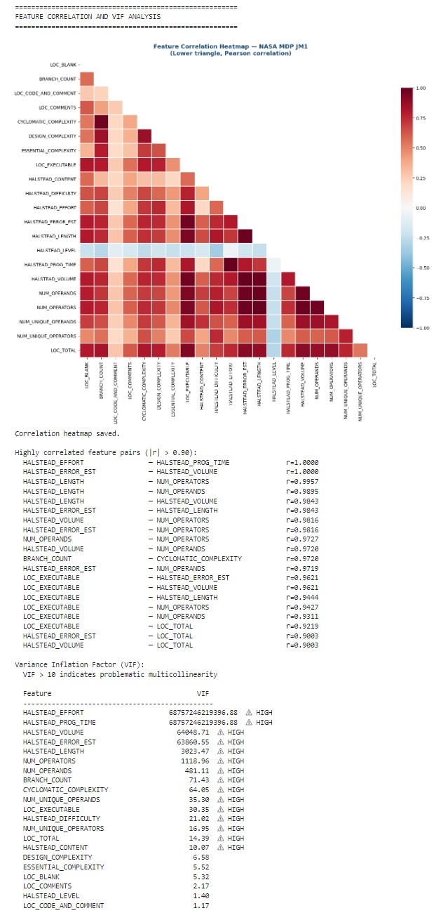
</p>
<p align="center">
  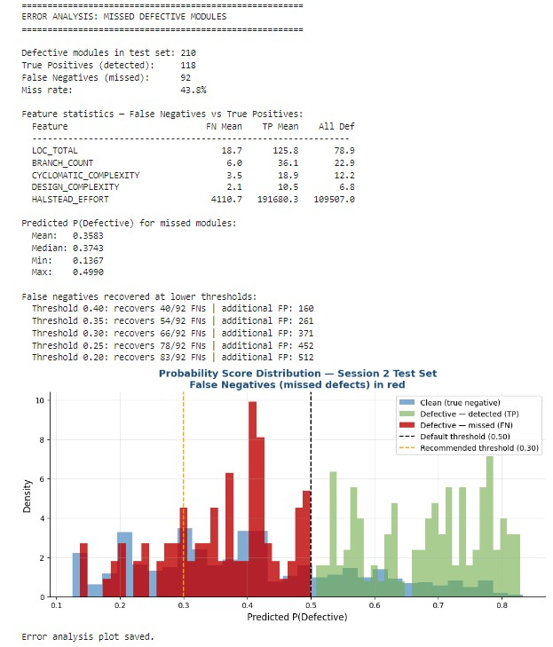
</p>

---

## Negative Findings

**Finding 1 - Random Forest Consistently Overfits on SMOTE-Augmented Tabular Data**

Random Forest was evaluated across six configurations in two sessions and failed the overfit gate in every case. The root cause is the interaction between bagged tree ensembles and synthetic minority samples generated by SMOTE. Random Forest builds independent trees that memorize the synthetic minority patterns generated by SMOTE even under aggressive depth constraints. By contrast, XGBoost's sequential error correction with built-in L1/L2 regularization is more resistant to this interaction. Practitioners applying SMOTE for class balancing in tabular risk classification pipelines should prefer gradient boosting methods over bagged ensemble methods. This finding is consistent with known limitations in imbalanced learning literature and is reproduced here across six configurations in two independent dataset sessions.

**Finding 2 - Synthetic Data is Deceptively Easy to Classify**

The binary-recast experiment (Session 1b) establishes that under identical task conditions, binary synthetic data (CV F1: 0.8101) exceeds binary real-world NASA MDP data (CV F1: 0.7439). The original 30.5% four-class-to-binary gap was substantially driven by task structure, not dataset authenticity alone. Organisations that evaluate ML risk models only on synthetic data may be reporting performance that will not generalise to real operational environments. This finding inverts the naive interpretation and is the primary contribution of the binary-recast experiment.

**Finding 3 - Preprocessed Kaggle Version of NASA MDP Data Obscures Authentic Distributions**

A preprocessed version of the NASA MDP JM1 dataset available on Kaggle was identified and rejected before modeling. Inspection revealed all features had been normalized to [0, 1] with suspiciously low unique value counts (CYCLOMATIC_COMPLEXITY: 24 unique values out of 1,000 rows; INT_FAN_IN: 10 unique values). This preprocessing eliminated the authentic distribution variation that makes the NASA MDP data valuable for real-world defect prediction research. The raw ARFF format from the original NASADefectDataset GitHub repository was used instead. This finding establishes dataset provenance verification as a required step in any governance-aligned modeling pipeline.

**Finding 4 - Logistic Regression Requires No Probability Calibration; XGBoost Does**

Platt Scaling applied to Logistic Regression produced a negligible Brier Score change of −0.0033, confirming that LR is inherently well-calibrated by design. Isotonic Regression applied to XGBoost produced a 29.3% Brier Score improvement (0.1989 → 0.1406), confirming that gradient boosting methods require explicit post-hoc calibration for reliable probability outputs. At threshold 0.30, uncalibrated XGBoost flags 72.6% of modules as Defective vs 19.9% calibrated, a dramatic demonstration that uncalibrated scores are not directly usable for operational threshold tuning.

**Finding 5 - Small Defective Modules Are Systematically Missed**

Error analysis reveals that missed defective modules (false negatives) are systematically smaller and simpler than detected ones: FN mean LOC_TOTAL = 18.7 vs TP mean = 125.8 (6.7× difference). The model has learned a complexity-driven rule and has a systematic blind spot for small, simple defective modules. Threshold tuning alone cannot eliminate this blind spot; additional features capturing defect-relevant properties independent of size and complexity are required.

**Finding 6 - Severe Multicollinearity in NASA MDP Features**

VIF analysis reveals that 15 of 21 features have VIF > 10, with two pairs perfectly correlated (HALSTEAD_EFFORT = HALSTEAD_PROG_TIME, r=1.0000; HALSTEAD_ERROR_EST = HALSTEAD_VOLUME, r=1.0000). Individual SHAP values for highly correlated features should be interpreted collectively. XGBoost's regularisation mitigates the modelling impact but redundant features inflate apparent feature set complexity without adding independent predictive signal.

---

## Deployment Risk Profiling

The current model's deployment implications extend beyond test set accuracy. In a real software project portfolio context:

**Portfolio scale implications (based on observed false negative rate of 43.8% on minority class):**

| Portfolio Size | Expected Defective (19%) | Missed Defects (FN) | False Alarms (FP) | Net Risk |
|---|---|---|---|---|
| 100 modules | ~19 | ~8 | ~11 | 8 undetected defects |
| 500 modules | ~95 | ~42 | ~54 | 42 undetected defects |
| 1,000 modules | ~190 | ~83 | ~107 | 83 undetected defects |
| 5,000 modules | ~950 | ~416 | ~537 | 416 undetected defects |

**Important caveat:** The 19% defective rate in NASA MDP is higher than typical real-world software project defect rates. In a mature software organization with lower defect density, false positive rates would increase relative to true positives, increasing review burden without proportional detection improvement.

**Recommended deployment controls:**
- Treat current model as a research prototype requiring retraining on organizational codebase before production use
- Apply calibrated probability threshold tuning, set P(Defective) > 0.30 rather than default 0.50 to reduce false negatives (recovers 66/92 missed modules at the cost of 371 additional false positives)
- Prioritize recall optimization before SOC or QA pipeline integration, false negatives (missed defects) carry higher governance cost than false positives
- Apply in triage mode: flag high-probability modules for mandatory human review rather than automated pass/fail decisions
- Conduct quarterly retraining as codebases and defect patterns evolve over project lifecycles
- Apply Walk-Forward Validation when deploying on time-stamped project data in production

---

## Key Findings

1. **Synthetic data is deceptively easy to classify.** Binary synthetic CV F1 (0.8101) exceeds binary real-world CV F1 (0.7439) under identical task conditions. The original 30.5% gap was substantially a task structure artefact. Evaluating ML risk models exclusively on synthetic data systematically overestimates deployment readiness.

2. **All cross-session F1 differentials are statistically significant.** Paired t-test p < 0.05 and Cohen's d > 6 (large effect) for all three pairwise comparisons. 95% confidence intervals confirm no overlap between any session pair. Wilcoxon non-significance (p=0.0625) is an expected small-sample limitation, not a contradiction.

3. **Logistic Regression is competitive on synthetic data; XGBoost on real data.** The best model type shifts with data authenticity. Synthetic data's near-linear relationships favor simpler models, while real-world complexity rewards gradient boosting with regularization. SHAP analysis provides the mechanistic explanation: governance features dominate in synthetic data; code volume features dominate in real data.

4. **SMOTE contributes +0.131 CV F1 and 1.7× stability improvement.** Without SMOTE, XGBoost CV F1 drops to 0.6129 ± 0.0124. SMOTE is essential for stable generalisation on imbalanced real-world data.

5. **Probability calibration is essential for XGBoost threshold tuning.** Uncalibrated XGBoost flags 72.6% of modules at threshold 0.30 vs 19.9% calibrated. Calibration method must match model family: Platt Scaling provides no gain for LR; Isotonic Regression provides 29.3% Brier improvement for XGBoost.

6. **Random Forest consistently overfits on SMOTE-augmented tabular data.** Across six tuning configurations in two sessions, Random Forest failed the 0.05 overfit gate. This is attributed to the interaction between bagged tree ensembles and synthetic minority samples generated by SMOTE, a reproducible negative finding.

7. **Small defective modules are systematically missed.** Missed defects have mean LOC_TOTAL of 18.7 vs 125.8 for detected ones (6.7× difference). The model learned a complexity-driven rule with a structural blind spot for small, simple defective modules.

8. **Severe multicollinearity in NASA MDP features.** 15 of 21 features have VIF > 10; two pairs are perfectly correlated (r=1.0000). SHAP values for correlated features should be interpreted collectively, not individually.

9. **Cross-validation provides a more honest performance estimate than single validation splits.** In Session 2, validation set F1 ranged from 0.64-0.66 while 5-fold CV revealed the true performance at 0.7439. Cross-validation on the full training set is the recommended primary metric.

10. **Dataset provenance verification is a required step before modeling.** Visual inspection of the Kaggle-hosted NASA dataset revealed preprocessing that obscured raw data distributions. Direct use of the raw ARFF source data was necessary to preserve authentic feature variation.

---

## Dataset Comparison Summary

| | Synthetic Dataset | NASA Raw MDP |
|---|---|---|
| Source | AI-generated (Kaggle) | NASA Metrics Data Program |
| Rows | 4,000 | 10,878 |
| Features | 49 | 21 |
| Task | 4-class risk classification | Binary defect classification |
| SMOTE required | No (`class_weight` used) | Yes (80/20 imbalance) |
| Dummy classifier F1 | 0.1296 | 0.4466 |
| CV F1 (macro) | 0.5700 | **0.7439** |
| CV Std | 0.0165 | **0.0074** |
| Binary recast CV F1 | **0.8101** | - |
| ML lift over dummy | +0.4576 | +0.1616 |
| Best model | Logistic Regression | XGBoost |
| Test F1 | 0.5872 | 0.6082 |
| Test Accuracy | 0.58 | 0.70 |
| Brier Score (uncal) | 0.1390 | 0.1989 |
| Brier Score (cal) | 0.1423 (no gain) | 0.1406 (29.3% gain) |
| ROC AUC | 0.911 (Critical) | 0.7119 |
| PR AUC | 0.679 (Critical) | 0.4127 |
| Top SHAP feature | Org_Process_Maturity (0.69) | LOC_TOTAL (0.46) |
| Top feature type | Governance / human-factor | Code volume / complexity |
| VIF > 10 features | Low | 15 of 21 |
| Inference Ready | ❌ No | ✅ Closer |
| Performance gain | baseline | **+30.5% F1 (4-class vs binary task)** |

---

## AI Governance and Responsible Development Principles

This project was developed with explicit attention to AI governance principles aligned with the NIST AI Risk Management Framework (AI RMF 1.0):

- **Honest performance reporting:** All model tuning iterations, including failed Random Forest configurations and overfitting diagnoses, were retained in the evaluation record. Negative findings (Random Forest consistently overfitting, synthetic data ceiling, preprocessed data quality degradation, calibration ineffectiveness on LR, McNemar's non-significant result) have equal evidentiary value to positive ones.
- **Dataset integrity auditing:** Systematic comparison of the Kaggle-preprocessed and raw ARFF versions of the NASA MDP dataset identified significant data quality degradation in the preprocessed version. Raw source data was used to preserve authenticity.
- **Overfitting prevention protocol:** A formal overfit gap threshold (0.05) was applied as a pass/fail gate across every model configuration, preventing deployment of models that memorize training data.
- **Missing value transparency:** Imputation strategy documented with rationale for method selection. Median imputation chosen over zero-fill for compliance and maturity score features where zero is not a semantically valid absence value.
- **Class imbalance transparency:** SMOTE augmentation applied exclusively to Session 2 training data. Session 1 used `class_weight='balanced'`. Validation and test sets retained the original distribution in both sessions.
- **Probability calibration:** Post-hoc calibration applied and Brier Score reported for both calibrated and uncalibrated outputs. Calibration method matched to model family (Platt Scaling for LR, Isotonic Regression for XGBoost). Threshold sensitivity analysis documented.
- **SHAP explainability:** Decision-level transparency provided via SHAP for both sessions (LinearExplainer for LR, TreeExplainer for XGBoost), satisfying NIST AI RMF 1.0 transparency requirements. VIF analysis contextualises SHAP values under multicollinearity.
- **Statistical validation:** Paired t-test, Wilcoxon signed-rank, 95% confidence intervals, and Cohen's d effect sizes reported for all cross-session comparisons. Wilcoxon non-significance documented as a known small-sample limitation rather than selectively omitted.
- **Deployment risk profiling:** False negative rates extrapolated to portfolio scale. Calibrated probability threshold recommendations documented. Error analysis identifies the small-module blind spot as a structural limitation requiring feature engineering rather than threshold tuning alone.
- **Reproducibility:** All data sourcing steps, including the exact GitHub URL for the raw ARFF file and the rationale for JM1 selection over other MDP datasets, are documented to ensure full pipeline reproducibility. All random seeds fixed at 42 throughout.

---

## Governance & Compliance Alignment

- **NIST SP 800-37** - Risk Management Framework: software defect prediction as a proxy for IT project risk treatment; overfitting prevention protocol aligns with the RMF "Assess" step requiring evidence-based control testing
- **CMMC Level 2/3** - Human-factor and software quality indicators as compliance risk signals subject to continuous monitoring; SHAP explainability satisfies audit transparency requirements
- **ISO 27001** - Information security risk treatment requiring quantified likelihood and impact estimates of the type produced by classification models; per-class precision, recall, and false negative counts directly provide those estimates
- **PMI PMBOK** - Project performance domain variables: scope, schedule, and quality risk indicators
- **NIST AI RMF 1.0** - Responsible AI development practices applied throughout; SHAP explainability satisfies transparency requirements; calibrated probability outputs satisfy Manage function requirements; deployment risk profiling satisfies Govern function requirements

---

## Technical Specification

| Parameter | Session 1 (Synthetic) | Session 2 (NASA MDP) |
|---|---|---|
| Dataset | Kaggle synthetic CSV | NASA MDP JM1.arff (raw) |
| Rows | 4,000 | 10,878 |
| Features | 49 | 21 |
| Target | 4-class risk level | Binary defect label |
| Train/Val/Test Split | 80/10/10 stratified | 80/10/10 stratified |
| Scaling | StandardScaler (post-split, train only) | StandardScaler (post-split, train only) |
| Missing value strategy | Median (numeric), Mode (categorical) | None required |
| Class balancing | `class_weight='balanced'` | SMOTE (training only) |
| Cross-validation | 5-fold stratified CV | 5-fold stratified CV |
| Dummy classifier F1 | 0.1296 | 0.4466 |
| Selected model | Logistic Regression | XGBoost |
| Final test F1 | 0.5872 | 0.6082 |
| Overfit gap (selected) | 0.0079 | 0.0440 |
| Brier Score (uncal / cal) | 0.1390 / 0.1423 | 0.1989 / 0.1406 |
| ROC AUC | 0.752-0.911 (per class) | 0.7119 |
| PR AUC | 0.544-0.679 (per class) | 0.4127 |
| Top SHAP feature | Org_Process_Maturity (0.69) | LOC_TOTAL (0.46) |
| VIF > 10 features | Low | 15 of 21 |
| McNemar's (LR vs XGB) | N/A | p=0.1014 (not significant) |
| Platform | Kaggle (CPU) | Kaggle (CPU) |
| random_state | 42 (all) | 42 (all) |

---

## Requirements

All dependencies are listed in `requirements.txt`. Install with:

```bash
pip install -r requirements.txt
```

---

## How to Run

```bash
# 1. Clone the repo
git clone https://github.com/GraceE-Dion/IT-Project-Risk-Classification.git
cd IT-Project-Risk-Classification

# 2. Install dependencies
pip install -r requirements.txt

# 3. Run notebooks in order
jupyter notebook notebooks/01_synthetic_baseline.ipynb
jupyter notebook notebooks/02_nasa_mdp_real_data.ipynb
```

> Notebooks were developed and executed on Kaggle (free CPU). No GPU required. The NASA MDP dataset is loaded directly from GitHub via `urllib` - no manual download needed.

---

## Limitations & Next Steps

### Current Limitations

- **Proxy nature of Session 2 data.** The NASA MDP dataset contains software code metrics only, does not include governance, human-factor, or cybersecurity compliance features directly. Defect prediction serves as a proxy for IT project risk, not a direct risk classification. SHAP analysis confirms the model responds to code volume signals (LOC_TOTAL, DESIGN_COMPLEXITY) rather than the governance indicators that NIST SP 800-37 and CMMC identify as primary risk variables.
- **Binary recast resolves task structure confounder.** Session 1b confirms that under identical binary task conditions, synthetic data is deceptively easy (CV F1: 0.8101 > 0.7439). The label cardinality confounder has been addressed experimentally.
- **Small-module blind spot.** Missed defective modules are 6.7× smaller than detected ones by LOC_TOTAL (18.7 vs 125.8). Threshold tuning alone cannot eliminate this blind spot; additional features capturing defect-relevant properties of small modules independent of size and complexity are required.
- **Severe multicollinearity.** 15 of 21 NASA MDP features have VIF > 10; two pairs are perfectly correlated (r=1.0000). Dimensionality reduction (PCA, feature selection) is recommended for future work.
- **McNemar's test non-significant.** XGBoost's F1 advantage over LR (0.6082 vs 0.5951) is not accompanied by a statistically distinct error pattern at the individual prediction level (p=0.1014).
- **Calibration scope.** Calibration was applied post-hoc on the validation set only. A more robust approach would incorporate calibration within the cross-validation loop. Deferred to future work.
- **Temporal structure.** Both datasets are static snapshots without timestamp information. Temporal leakage is not applicable here, but any production deployment on time-stamped IT project data would require Walk-Forward Validation rather than stratified splitting.

### Next Steps
1. Source or construct a dataset with explicit governance, human-factor, and cybersecurity compliance features aligned with NIST SP 800-37 and CMMC frameworks
2. Address the small-module blind spot through additional feature engineering independent of size and complexity metrics
3. Apply dimensionality reduction to address severe multicollinearity (15/21 features VIF > 10)
4. Incorporate calibration within the cross-validation loop for a more robust calibrated generalisation estimate
5. Extend to multi-class risk classification (Critical / High / Medium / Low) using a governance-aligned dataset
6. Apply Walk-Forward Validation when this pipeline is deployed on time-stamped project data in production

---

## Related Work

This project is part of a 7-project ML portfolio in human-factor risk analytics
for cybersecurity governance:

1. **IT Project Risk Classification** *(this project)*
2. [Insider Threat Detection - CERT r4.2](https://github.com/GraceE-Dion/Insider-Threat-Detection-CERT-r4.2)
3. Network Intrusion Detection *(in development)*
4. Phishing URL Detection *(planned)*
5. Financial / Digital Banking ML Suite *(planned)*
6. Medical Diagnosis Classification *(planned)*
7. Manufacturing Defect Detection *(planned)*

---

## Author

**Grace Egbedion**
Technical Program Manager | Cybersecurity Governance Specialist | PhD Candidate
MTSU, Computational and Data Science

Certifications: PMP, SAFe, PSM I/II, PSPO, CompTIA Security+

Research: Human-factor risk analytics, AI governance, IT cybersecurity program management

Publications: 5 peer-reviewed publications (2024-2025) | 27+ citations | 4,500+ reads

[GitHub](https://github.com/GraceE-Dion) | [LinkedIn](https://www.linkedin.com/in/grace-egbedion/)

---

## License

MIT License - see [LICENSE](LICENSE) for details.

---

## Citation

If you reference this work:
```
Egbedion, G. (2025). IT Project Risk Classification: A Machine Learning Framework
for Cybersecurity Governance and Human-Factor Risk Analytics. GitHub Repository.
https://github.com/GraceE-Dion/IT-Project-Risk-Classification
```
